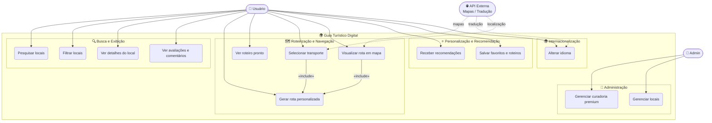

# Casos de uso

```mermaid
%%{init: {'theme': 'default'}}%%
graph TD
    U([👤 Usuário])
    A([🔧 Admin])
    E([🌐 API Externa\nMapas / Tradução])

    subgraph Sistema["🌍 Guia Turístico Digital"]

        subgraph Busca["🔍 Busca e Exibição"]
            UC1(Pesquisar locais)
            UC2(Filtrar locais)
            UC3(Ver detalhes do local)
            UC4(Ver avaliações e comentários)
        end

        subgraph Roteirizacao["🗺️ Roteirização e Navegação"]
            UC5(Gerar rota personalizada)
            UC6(Ver roteiro pronto)
            UC7(Selecionar transporte)
            UC8(Visualizar rota em mapa)
        end

        subgraph Personalizacao["⭐ Personalização e Recomendação"]
            UC9(Receber recomendações)
            UC10(Salvar favoritos e roteiros)
        end

        subgraph Idioma["🌍 Internacionalização"]
            UC11(Alterar idioma)
        end

        subgraph Administracao["🔧 Administração"]
            UC12(Gerenciar curadoria premium)
            UC13(Gerenciar locais)
        end

    end

    U --> UC1
    U --> UC2
    U --> UC3
    U --> UC4
    U --> UC5
    U --> UC6
    U --> UC7
    U --> UC8
    U --> UC9
    U --> UC10
    U --> UC11

    A --> UC12
    A --> UC13

    UC7 -->|«include»| UC5
    UC8 -->|«include»| UC5

    E -.->|mapas| UC8
    E -.->|tradução| UC11
    E -.->|localização| UC7
```
