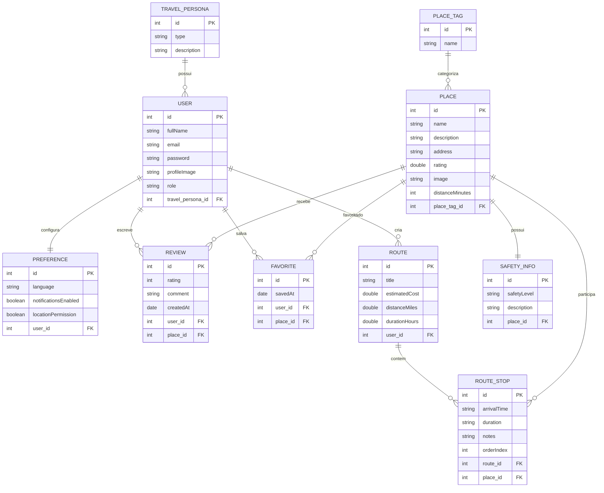

```mermaid
erDiagram

    TRAVEL_PERSONA ||--o{ USER : possui
    USER ||--|| PREFERENCE : configura
    PLACE_TAG ||--o{ PLACE : categoriza

    USER ||--o{ REVIEW : escreve
    PLACE ||--o{ REVIEW : recebe

    USER ||--o{ FAVORITE : salva
    PLACE ||--o{ FAVORITE : favoritado

    USER ||--o{ ROUTE : cria

    ROUTE ||--o{ ROUTE_STOP : contem
    PLACE ||--o{ ROUTE_STOP : participa

    PLACE ||--|| SAFETY_INFO : possui

    USER {
        int id PK
        string fullName
        string email
        string password
        string profileImage
        string role
        int travel_persona_id FK
    }

    PREFERENCE {
        int id PK
        string language
        boolean notificationsEnabled
        boolean locationPermission
        int user_id FK
    }

    TRAVEL_PERSONA {
        int id PK
        string type
        string description
    }

    PLACE_TAG {
        int id PK
        string name
    }

    PLACE {
        int id PK
        string name
        string description
        string address
        double rating
        string image
        int distanceMinutes
        int place_tag_id FK
    }

    REVIEW {
        int id PK
        int rating
        string comment
        date createdAt
        int user_id FK
        int place_id FK
    }

    FAVORITE {
        int id PK
        date savedAt
        int user_id FK
        int place_id FK
    }

    ROUTE {
        int id PK
        string title
        double estimatedCost
        double distanceMiles
        double durationHours
        int user_id FK
    }

    ROUTE_STOP {
        int id PK
        string arrivalTime
        string duration
        string notes
        int orderIndex
        int route_id FK
        int place_id FK
    }

    SAFETY_INFO {
        int id PK
        string safetyLevel
        string description
        int place_id FK
    }
```
